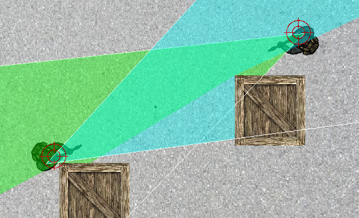

# 2D Shooter Game

## General info

#### Game
This project contains shooter type video game. It is simple 2D game with top-down perspective. The project contains about 1800 lines of code and it is written in C++ with SFML library. Shooter is in 1 vs 1 mode and it is possible to play player vs player or player vs bot. The biggest problem with this project was to create a method that returns a logical true if the enemy is visible. At the beggining the game was designed to aggregate states and control of the agent. That is why, it contains a lot of attributes and methods for it. 

## Technologies

Project is created with:
* C++ version: 17
* SFML version: 2.4.2

## Setup
To run the game, compile main.cpp with player.cpp and player.h.

